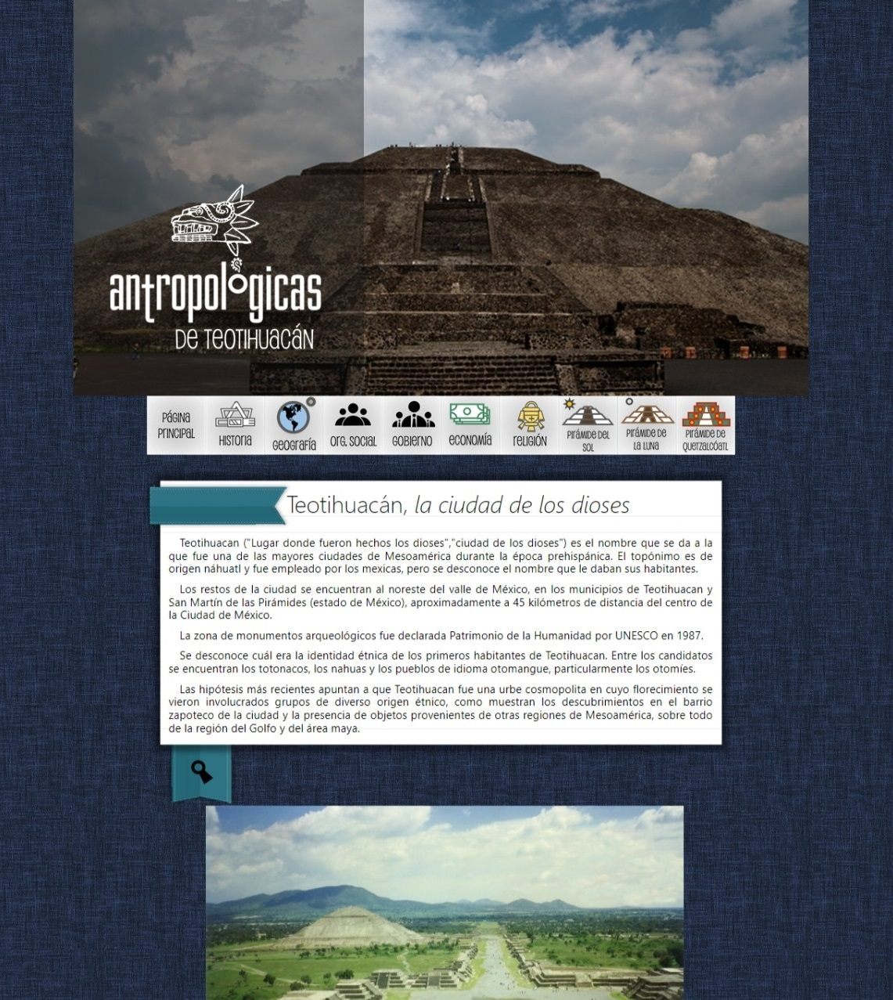

# Teotihuacan legacy web project



## To run

It's a simple web page, you can open directly the `index.html` page using your browser.

I recommend open this using a local web server, like [npm serve](https://github.com/vercel/serve):

```bash
# if you don't already have it
npm i -g serve
# clone this repo
git clone https://github.com/JoelHernandez343/teotihuacan-legacy-web-project.git
# run the local web server using the folder where is the repo
serve teotihuacan-legacy-web-project
```

## Description and background

This was a high shool project (~2013) for the Technology subject that was never graded by my teacher. I don't know why she assigned us this kind of project when we didn't know anything about web development.

I was pretty excited because I always wanted to develop a web site and this was my opportunity. I started learning using a site called "Cómo crear tu página web" or something along those lines - I couldn't find the site in 2024 even using the Internet Archive :sob:

I think this was my first real web project where I applied everything I'd learn until that day.

We were like 6 people in the team and I did the whole site alone... yeah, fun times. Their names are immortalized in the `acerca.html` page tho.

## TODOs

-   [x] Correct encoding for all the html files
-   [ ] Simplify the image logic

## Members

### Group

3107

### Team integrated by

| #   | Name                                   |
| --- | -------------------------------------- |
| 12  | Joel Harim Hernández Javier            |
| 13  | Aldo Ángel Hernández Olmos             |
| 18  | Manuel Mendoza Cano                    |
| 20  | Cristian Áxel Jesús Octaviano González |
| 25  | Roberto Ramírez Rosas                  |
| 35  | Javier Tenorio Camacho                 |

## Written report

[This was the original written report](./written_report.pdf)
